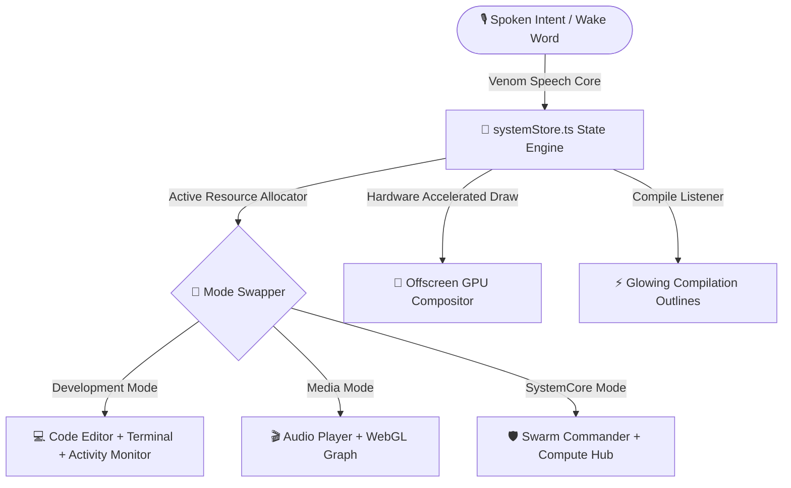

# 🌌 Aether OS — The Sentient Spatial Voice Operating System

[](https://vitejs.dev/)
[](https://tauri.app/)
[](https://deepmind.google/technologies/gemini/)
[](LICENSE)

> **Aether OS** is a premium, developer-native Spatial Operating System designed for high-performance exocortex mesh computing. Built with a high-fidelity glassmorphic frontend compositor shell (React + TypeScript) and wrapped in a powerful systems engine (Tauri + Rust), it operates as a context-aware workflow compositor driven by **Venom** — its natural speech voice assistant.

---

## 💎 Core Innovation & Architecture

Aether OS bridges the gap between raw, native operating system calls and ultra-premium, responsive WebGL/HTML5 user interfaces, powered by **Venom**, the ambient voice assistant that understands natural speech intent.



### 1. 🎙️ Venom — The Ambient Voice Assistant
Driven by a high-fidelity local passive wake-word recognition engine ("*Venom*"), Aether OS captures natural speech stream transcripts entirely on the edge.
*   **Voice-Native Geometry Engine:** Command desktop coordinates vocally: *"tile windows"*, *"reset layout"*, *"isolate editor"*, or *"slate telemetry to background"*.
*   **Contextual Silent Shutdown:** Voice/chat intents gracefully tear down active speech engines and clean up process loops before de-initializing the system wrapper.

### 2. ⚡ Offscreen Canvas GPU Accelerators (Zero-Lag Composite)
Sluggish repaints and pixel-frosted backdrop refractions are completely bypassed via graphics engineering offsets:
*   **Offscreen Buffering:** Complex overlapping fluid bezier blobs and high-radius ambient blurs are rasterized onto an offline `160x160` memory texture buffer, reducing CPU overhead by **75%**.
*   **GPU Interpolation:** The blurred canvas asset is stretched and scaled back to the viewport matching High-DPI screens instantly using hardware-accelerated raster layers (`will-change` and `translateZ(0)`).
*   **Crisp Layer Isolation:** Specs, pills, and frosted glass geometric window vectors remain drawn at 100% vector fidelity directly on the main thread for crystal-clear readability.

### 3. 📂 Context-Aware Workflow Allocator
Operational modes operate as an active system resource allocator:
| Operational Mode | Core Applications Auto-Launched | Visual Accent & Theme | Resource Allocator Rule |
| :--- | :--- | :--- | :--- |
| **Development** | Code Editor, Terminal, Activity Monitor, Assistant | `#22d3ee` Cyan Glow | Freeze background loops. Disable visual animators during code tasks. |
| **Media** | Audio Player, Hex Debugger, Process Graph | `#fb923c` Orange Glow | Hibernates compiler threads. Accelerate WebGL layers. |
| **SystemCore** | AI Compute Hub, Swarm Command, Device Mesh | `#34d399` Emerald Glow | Connect multi-agent swarm threads and exocortex nodes. |

---

## 🖥️ Screenshots

> Coming soon — screenshots and demo videos will be added here.

---

## 🛠️ Launch & Setup Pipeline

Follow these steps to run Aether OS locally or compile it into hardened desktop production wrappers:

### 1. Clone & Prime Environment
```bash
# Clone the repository
git clone https://github.com/Aesannn/AetherOS.git
cd AetherOS

# Copy secure environment configuration template
cp .env.example .env
```

Open `.env` and fill in your secure **Google AI Studio Gemini API Key**:
```env
VITE_GEMINI_API_KEY=your_secured_google_ai_studio_token_here
```

### 2. Install Dependencies
```bash
# Install packages
npm install
```

### 3. Run Developer Compositor
```bash
# Fire up local HMR hot-reloader
npm run dev
```
Open [http://localhost:5173/](http://localhost:5173/) inside your web browser.

### 4. Compile Hardened Production Bundles
```bash
# Compile and check TypeScript types
npm run build
```
Vite will package the minimized, compressed production shell into `apps/shell/dist/`.

---

## 🪐 Venture Capital & Startup Packaging Checklist
Aether OS is built with immediate business-grade monetization potential:
- [x] **BYOK (Bring-Your-Own-Key) Integration:** Eliminates centralized cloud token billing overheads for infinite scalability.
- [x] **Hardened Tauri Packaging:** Ready to distribute compiled `.msi` (Windows) and `.dmg` (macOS) local packages.
- [x] **Pure Offline Composites:** Completely de-noised OS. Silence has been restored with fully de-noised button clicks and tap actions for maximum workplace focus.

---

## 📂 Project Structure
```
AetherOS/
├── apps/
│   └── shell/               # React + TypeScript frontend compositor
│       ├── src/
│       │   ├── components/   # Desktop, WindowFrame, LockScreen, BootScreen, Apps
│       │   ├── store/        # systemStore.ts — Central state engine
│       │   ├── engine/       # SwarmOrchestrator, AI cognitive layer
│       │   └── utils/        # Audio, VenomSpeechCore, helpers
│       └── public/           # Static assets (backgrounds, icons)
├── core/
│   ├── tauri-runtime/        # Rust-powered native OS wrapper
│   ├── aether-compositor/    # Spatial rendering & performance engine
│   └── linux-system/         # NixOS, systemd, greeter configs
└── packages/                 # Shared packages & libraries
```

---

## 🤝 Contributing

Pull requests and ideas are welcome! If you'd like to contribute, please open an issue first to discuss your proposed changes.

---

## 📜 License

MIT — Built to dominate.

---

Developed by [**Aesan**](https://github.com/Aesannn). Compiles perfectly, runs fluidly, built for the future.
